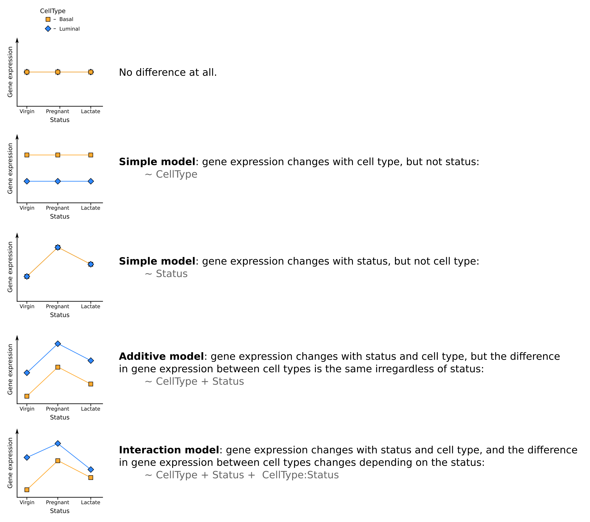

```{r setup, echo=FALSE}
options(tibble.print_max = 4, tibble.print_min = 4, max.print=40, 
        tibble.max_extra_cols=2)
```

# Recap of pre-processing

The previous section walked-through the pre-processing and transformation of the
count data. Here, for completeness, we list the minimal steps required to 
process the data prior to differential expression analysis.

```{r recap, eval = FALSE}
# Read the sample information into a data frame
sampleinfo <- read_tsv("data/SampleInfo.Corrected.txt")

# Read the data into R
seqdata <- read_tsv("data/GSE60450_Lactation.featureCounts", comment = "#")

# Transform the data to matrix of counts
countdata <- as.data.frame(seqdata) %>% 
    column_to_rownames("Geneid") %>% # turn the geneid column into rownames
    rename_all(str_remove, ".bam") %>% # remove the ".bam" from the column names
    select(sampleinfo$Sample) %>% # keep sample columns using sampleinfo
    as.matrix()

# filter the data to remove genes with few counts
keep <- rowSums(countdata) > 5
countdata <- countdata[keep,]
```

## Load the data

Alternatively we can load the `objects with the RData file we created in the 
pre-processing tutorial.

First load the packages we need.

```{r message = FALSE}
library(tidyverse)
library(DESeq2)
```

```{r loadData}
# load the RData object we created in the previous session
load("Robjects/preprocessing.RData")
ls()
dim(countdata)
sampleinfo
```

# The model formula and design matrices

Now that we are happy that the quality of the data looks good, we can 
proceed to testing for differentially expressed genes. There are a number of 
packages to analyse RNA-Seq data. Most people use 
[DESeq2](http://bioconductor.org/packages/devel/bioc/vignettes/DESeq2/inst/doc/DESeq2.html) 
or [edgeR](http://bioconductor.org/packages/release/bioc/html/edgeR.html). They 
are both equally applicable. There is an informative and honest blog post
[here](https://mikelove.wordpress.com/2016/09/28/deseq2-or-edger/) by Mike Love,
one of the authors of DESeq2, about deciding which to use.

We will use **DESeq2** for the rest of this practical.

## Create a DESeqDataSet object with the raw data

### Creating the design model formula

First we need to create a design model formula for our analysis. `DESeq2` will 
use this to generate the model matrix, as we have seen in the linear models 
lecture. 

We have two variables in our experiment: "Status" and "Cell Type". 

We will fit two models under two assumptions: no interaction and interaction of
these two factors, however, to demonstrate the how DESeq2 is used we will start
with a simple model which considers Status but ignores Cell Type 


```{r modelForumla}
# Use the standard R 'formula' syntax for an additive model
design <- as.formula(~ Status)
```

What does this look like as a model matrix?
```{r modelMatrix}
modelMatrix <- model.matrix(design, data = sampleinfo)
modelMatrix
```

It would be nice if `virgin` were the base line/intercept. To get R to 
use `virgin` as the intercept we need to use a `factor`. Let's set factor levels
on Status to use virgin as the intercept.

```{r setFactors}
sampleinfo$Status <- factor(sampleinfo$Status, 
                            levels = c("virgin", "pregnant", "lactate"))
modelMatrix <- model.matrix(design, data = sampleinfo)
modelMatrix
```

# Build a DESeq2DataSet

We don't actually need to pass `DESeq2` the model matrix, instead we pass it the 
design formula and the `sampleinfo` it will build the matrix itself.

```{r makeDDSObj}
# create the DESeqDataSet object
ddsObj.raw <- DESeqDataSetFromMatrix(countData = countdata,
                                     colData = sampleinfo,
                                     design = design)
```


# Differential expression analysis with DESeq2

## The `DESeq2` work flow

The main `DESeq2` work flow is carried out in 3 steps:

First, Calculate the "median ratio" normalisation size factors...

```{r commonSizeFactors}
ddsObj <- estimateSizeFactors(ddsObj.raw)
```

### Let's have a look at that that did

```{r}
colData(ddsObj.raw)
colData(ddsObj)
```


We can use `plotMA` from `limma` to look at the data in an MA plot

```{r}
logcounts <- log2(countdata + 1)

limma::plotMA(logcounts)
abline(h=0)
```

```{r}
normalizedCounts <- counts(ddsObj, normalized=TRUE) 
logNormalizedCounts <- log2(normalizedCounts + 1)

limma::plotMA(logNormalizedCounts)
abline(h=0)
```

DESeq2 doesn't actually normalise the counts, it uses raw counts and includes
the size factors in the modelling. Please see the DESeq2 documentation if you'd
like more details on exactly how they are incorporated into the algorithm. For
practical purposes we can think of it as a normalisation.

... next estimate dispersion ...

```{r genewiseDispersion}
ddsObj <- estimateDispersions(ddsObj)
```

... finally, apply Negative Binomial GLM fitting and calculate Wald statistics
```{r applyGLM}
ddsObj <- nbinomWaldTest(ddsObj)
```

## The `DESeq` command

In practice the 3 steps above can be performed in a single step using the 
`DESeq` wrapper function. Performing the three steps separately is useful if you
wish to alter the default parameters of one or more steps, otherwise the `DESeq`
function is fine.

```{r theShortVersion}
# Run DESeq
ddsObj <- DESeq(ddsObj.raw)
```

## Generate a results table

We can generate a table of differential expression results from the DDS object
using the `results` function of DESeq2.

```{r resultsTable}
res <- results(ddsObj, alpha=0.05)
res
```

### Independent filtering

You will notice that some of the adjusted p-values (`padj`) are NA. Remember 
in Session 2 we said that there is no need to pre-filter the genes as DESeq2
will do this through a process it calls 'independent filtering'. The genes 
with `NA` are the ones `DESeq2` has filtered out.

From `DESeq2` manual:
"The results function of the `DESeq2` package performs independent filtering by
default using the mean of normalized counts as a filter statistic. A threshold 
on the filter statistic is found which optimizes the number of adjusted p values
lower than a [specified] significance level".

The default significance level for independent filtering is `0.1`, however, you
should set this to the FDR cut off you are planning to use. We will use `0.05` -
this was the purpose of the `alpha` argument in the previous command.

### The default contrast of `results`

The `results` function has returned the results for the contrast "lactate vs 
virgin". Let's have a look at the model matrix to understand why `DESeq2` has 
given us this particular contrast.

```{r viewModelMatrix}
modelMatrix
```

By default, `results` has returned the contrast encoded by the final column in
the model matrix. `DESeq2` has the command `resultsNames` that allows us to
view the contrasts that are available directly from the model matrix.

```{r resultsNames}
resultsNames(ddsObj)
```

Let's just rename `res` so that we know which contrast results it contains.

```{r}
resLvV_status <- res
rm(res)
```

If we want a different contrast we can just pass the `results` function the name
of the design matrix column that encodes it.
Let's retrieve the results for pregant versus virgin

```{r resultPvV}
resPvV_status <- results(ddsObj, 
                  name="Status_pregnant_vs_virgin", 
                  alpha = 0.05)
resPvV_status
```

Let's get the top 100 genes by adjusted p-value

```{r topGenesPvV, message = F, results="hide"}
topGenesPvV <- as.data.frame(resPvV_status) %>%
    rownames_to_column("GeneID") %>% 
    arrange(padj) %>% 
    head(100)
topGenesPvV
```

### Exercise 1

> So far we have fitted a simple model considering just "Status", but in reality 
> we want to model the effects of both "Status" and "Cell Type".
> 
> Let's start with the model with only main effects - an additive model with no 
> interaction. The main assumption here is that the effect of the status on gene 
> expression is the same in both types of cells.
> 
> First we will recapitulate the above steps to generate a new DESeq2 object with
> the additive model. Then we will extract the results table for the contrast
> for "lactate v virgin".
> 
> 1. Load the raw data.   
>    Remember that we would like R to use 'Virgin' in the intercept of the mode,
>    so we need to transform the Status into a factor in the sample sheet and 
>    set "Virgin" to be the first level.
>   
> ```{r}
> load("Robjects/preprocessing.RData")
> sampleinfo$Status <- factor(sampleinfo$Status, 
>                             levels = c("virgin", "pregnant", "lactate"))
> ```
> 
> 2. Create the model
> 
> ```{r eval=FALSE}
> design <- as.formula(~ CellType + Status)
> ```
> 
> 2. Then build the DESeq from the raw data, the sample meta data and the model
> 
> ```{r eval=FALSE}
> ddsObj.raw <- DESeqDataSetFromMatrix(countData = countdata,
>                                      colData = sampleinfo,
>                                      design = design)
> ```
> 
> 3. Run the DESeq2 analysis
> 
> ```{r eval=FALSE}
> ddsObj <- DESeq(ddsObj.raw)
> ```
> 
> 4. Extract the default contrast - Lacate v Virgin
>
> ```{r eval=FALSE}
> resLvV <- results(ddsObj, alpha=0.05)
> ```
> 
> #### **Challenge 1** {.challenge}
>
> a) Obtain results for luminal vs basal.  Call the new results object `resLvB`.
> b) How many significantly upregulated genes are there?
>
> #### **Challenge 2 - Contrasts** {.challenge} 
>
> Suppose we want to find genes that are  differentially expressed between 
> **pregnant** and **lactate**. We don't have a parameter that explicitly will 
> allow us to test that hypothesis. We need to provide a contrast.
>   
> Look at the help page for `results` (`?results`) and read about the `contrast`
> argument (also look at Example 1 at the bottom of the help page)
> 
> Use the `contrast` argument to extract the results table for "pregnant v
> lactate".

```{r echo=FALSE, include=FALSE}
design <- as.formula(~ CellType + Status)
ddsObj.raw <- DESeqDataSetFromMatrix(countData = countdata, 
                                     colData = sampleinfo,
                                     design = design)
ddsObj <- DESeq(ddsObj.raw)
resLvV <- results(ddsObj, alpha=0.05)
```

# Should be using the interaction model?

So far we have modelled gene expression as a function of status and cell type 
with an additive model. It is possible that the two factors interact such that
differences in gene expression between different cell types are not the same
across all three mouse statuses:


[*pdf version*](../images/AdditiveAndInteractionModels.pdf)

Let's plot a PCA from `vst` transformed data. 
Can you anticipate if the interaction term will be important?

```{r pcaPlot, fig.width=5, fig.height=5}
vstcounts <- vst(ddsObj.raw, blind=TRUE)
plotPCA(vstcounts, intgroup=c("Status", "CellType"))
```

Maybe, but we can't be sure so we need a way to compare the two models.

## Comparing two design models

Let's take a simple example to start with.

Suppose we thought that maybe `status` were irrelevant and really the only 
differences might be between cell types. We could fit a simpler model and this 
would give us more degrees of freedom and therefore more power, but how
would we know if it was a better model of not? 

We can compare two models using the "likelihood ratio test" (LRT). 

To do so we provide the LRT with a simpler model (one with less parameters) than
the one currently be used. 

Currently `ddsObj` is using the model `~CellType + Status`. Here we want to
compare to a model without the `Status` parameter: `~CellType`

```{r compareModels}
# create the simpler model
design.reduced <- as.formula(~ CellType )

# Compare the two designs
ddsObjC <- DESeq(ddsObj, test="LRT", reduced=design.reduced)
resCvCS <- results(ddsObjC)
resCvCS
```

The second line of the results output shows us the test we are doing:

  `LRT p-value: '~ CellType + Status' vs '~ CellType'`

The null hypothesis is that there is no significant difference between the two
models, i.e. the simpler model is sufficient to explain the variation in gene
expression between the samples. If the the adjusted p-value for a gene passes
a significance threshold (e.g. padj < 0.05) then we should consider using the 
more complex model for this gene. 

```{r}
sum(resCvCS$padj < 0.05, na.rm=TRUE)
```

We can see that for `r sum(resCvCS$padj < 0.05, na.rm=TRUE)` genes the more 
complex model does fit the data better. This would suggest that we should be
including both terms in the linear model.

Although we have a result for each gene, in practice we should choose one model 
or the other and apply it to all genes.

### Exercise 2
>
> When we looked at the PCA it did seem that an interaction model might be
> warranted. Let's test that.  
>
> #### Challenge {.challenge}
>  
> 1. Create a new DESeq2 object using a model with an interaction between 
>    CellType and Status. The model formula should be 
>
>    `~CellType + Status + CellType:Status`
>
>    where `CellType:Status` is the parameter for the interaction beteween 
>    CellType and Status.  
>    Look back at the code at the beginning of Exercise 1 to remind you how to 
>    do this.
>
> Note that `*` can be used as shortcut to add the interaction term,
> e.g. `~CellType * Status`, however, writing out in long form is clearer here.
>
> 2. Use the LRT to compare this to the simpler additive model 
>    (`~CellType + Status`)
>
> 3. Extract a table of results using `results`. 
>
> #### Questions:
>  
>    For how many genes is interaction model a better fit?  
>
>    Do you think we need to use the interaction model for this analysis?
>
>    Do you think the experimental design is good enough to include the 
>    interaction? 
>
>    If not, why and how would you change it?   
>

```{r eval=FALSE, echo=FALSE, include=FALSE}
design <- as.formula(~ CellType * Status)
ddsObj2.raw <- DESeqDataSetFromMatrix(countData = countdata, 
                                     colData = sampleinfo,
                                     design = design)
# create the simpler model
design.reduced <- as.formula(~ CellType + Status)

# Compare the two designs
ddsObjC2 <- DESeq(ddsObj2.raw, test="LRT", reduced=design.reduced)
resCSvCxS <- results(ddsObjC2)
table(resCSvCxS$padj < 0.05)
```

## Finally save the results in a new RData object

```{r saveObjects, eval=FALSE}
save(resLvV, ddsObj, sampleinfo, file="results/DE.RData")
```

--------------------

